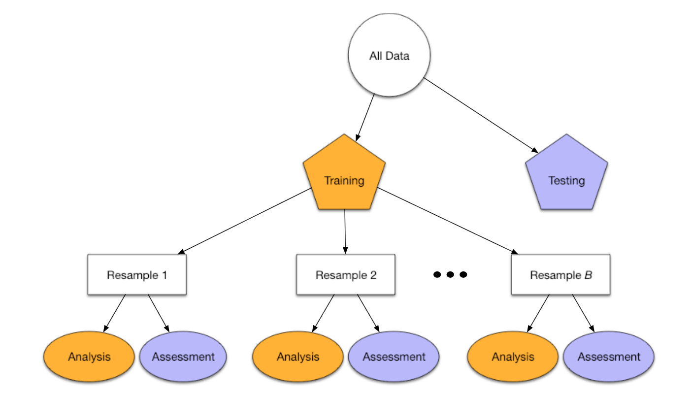

```{r setup, include=FALSE}

knitr::opts_chunk$set(echo = FALSE)

# Set Up

library(conflicted)
library(tidymodels)
library(tidyverse)

# Data Visualization
library(ggrepel)
library(corrplot)

conflict_prefer("filter", "dplyr")

```

<!-- Slide 2 -->
### **tidymodels** within the R Universe

\centering
{width=80%}

\begin{itemize}
  \item \textbf{tidymodels} is to MODELING what the \textbf{tidyverse} is to DATA WRANGLING;
  \item \textbf{tidymodels} has a modular approach: specific, smaller packages are designed to work hand in hand.
\end{itemize}


<!-- Slide 3 -->
### **tidymodels**' main packages

\centering
{width=80%}


<!-- Slide 4 -->
### Goal: predict diamond prices

```{r}

# Data Set: Diamonds

set.seed(1243)
data("diamonds")

diamonds %>% 
  sample_n(2000) %>% 
  mutate_if(is.factor, as.numeric) %>% 
  select(price, everything()) %>% 
  cor %>% 
  {.[order(abs(.[ ,1]), decreasing = TRUE),
     order(abs(.[ ,1]), decreasing = TRUE)]} %>% 
  corrplot(method = "number", type = "upper", mar = c(0, 0, 1.5, 0),
           title = "Correlations between price and various features of diamonds")

```


<!-- Slide 5 -->
### How are we going to do it?

\centering
{width=95%}


<!-- Slide 6 -->
### What tools do we have?

\centering
{width=100%}


<!-- Slide 7 -->
### Separating Testing and Training Data

\centering
{width=25%}

\begin{itemize}
  \item \textit{rsample} contains a set of functions to create different types of resamples and corresponding classes for their analysis:
  \begin{itemize}
    \item Traditional resampling techniques for estimating the sampling distribution of a statistic and;
    \item Estimating model performance using a holdout set.
  \end{itemize}
\end{itemize}


<!-- Slide 8 -->
### Separating Testing and Training Data

\scriptsize
```{r, echo=TRUE}

dia_split <- initial_split(diamonds, pro = .1, strata = price)

dia_train <- training(dia_split)
dia_test <- testing(dia_split)

dia_vfold <- vfold_cv(dia_train, v = 3, repeats = 1, strata = price)
print(dia_vfold)

```


<!-- Slide 9 -->
### Data Pre-Processing and Feature Engineering

\centering
{width=25%}

\begin{itemize}
  \item \textit{recipes} is a method for creating and pre-processing design matrices used for modeling or visualization;
  \item Idea: define a blueprint that can be used to sequentially define the encodings and pre-processing of the data;
  \item It is used to prepare a data set (for modeling) using different `step\_*()' functions;
  \item The `recipe()' takes a formula and a data set, and then the different steps are added.
\end{itemize}


<!-- Slide 10 -->
### Data Pre-Processing and Feature Engineering

\tiny
```{r, echo=TRUE}

dia_rec <- 
    recipe(price ~ ., data = dia_train) %>%
    step_log(all_outcomes()) %>%
    step_normalize(all_predictors(), -all_nominal()) %>%
    step_dummy(all_nominal()) %>%
    step_poly(carat, degree = 2)

prep(dia_rec)

```


<!-- Slide 11 -->
### Data Pre-Processing and Feature Engineering

\begin{itemize}
  \item Calling `prep()' on a recipe applies all steps;
  \item Call `juice()' to extract the transformed data set;
  \item Call `bake()' on a new data set.
\end{itemize}

\tiny
```{r, echo=TRUE}

dia_juiced <- juice(prep(dia_rec))
names(dia_juiced)

```


<!-- Slide 12 -->
### Defining and Fitting Models

\centering
{width=25%}

\begin{itemize}
  \item The goal is to provide a tidy, unified interface to models that can be used to try a range of models without getting bogged down in the syntactical minutiae of the underlying packages;
  \item Has wrappers around many popular machine learning algorithms, and you can fit then using a unified interface.
\end{itemize}
    
    
<!-- Slide 13 -->
### **Defining** and Fitting Models  
    
\begin{enumerate}
  \item Function specific to each algorithm;
  \item `set\_mode()' (regression or classification);
  \item `set\_engine()' back-end/engine/implementation
\end{enumerate}
    
\scriptsize
```{r, echo=TRUE}

lm_model <- 
    linear_reg() %>%
    set_mode("regression") %>%
    set_engine("lm")

print(lm_model)

```
    
  
<!-- Slide 14 -->
### **Defining** and Fitting Models  
    
\begin{itemize}
  \item Random Forest: `ranger' or `randomForest'?
  \item How to handle their different interfaces?
\end{itemize}
    
\scriptsize
```{r, echo=TRUE}

rand_forest(mtry = 3, trees = 500, min_n = 5) %>%
    set_mode("regression") %>%
    set_engine("ranger", importance = "impurity_corrected")

```


<!-- Slide 15 -->
### Defining and **Fitting** Models  
    
\begin{itemize}
  \item This example, with a formula. You can also set `x' and `y'.
\end{itemize}
    
\tiny
```{r, echo=TRUE}

lm_fit1 <- fit(lm_model, price ~ ., dia_juiced)
lm_fit1

``` 


<!-- Slide 16 -->
### Summarizing Fitted Models

\centering
{width=25%}

\begin{itemize}
  \item Takes the messy output of built-in function in R, such as `lm', `nls', and turns them into tidy tibbles;
  \item From \textbf{tidyverse}.
\end{itemize}


<!-- Slide 17 -->
### Summarizing Fitted Models
    
\begin{itemize}
  \item `glance()' reports information about the entire model;
  \item `tidy()' summarizes information about model components.
\end{itemize}
    
\tiny
```{r, echo=TRUE}

glance(lm_fit1$fit)

tidy(lm_fit1) %>%
    arrange(desc(abs(statistic))) %>%
    print()

``` 


<!-- Slide 18 -->
### Summarizing Fitted Models
    
\begin{itemize}
  \item `augment()' is used to get model predictions, residuals, etc.
\end{itemize}
    
\tiny
```{r, echo=TRUE}

lm_predicted <- augment(lm_fit1$fit, data = dia_juiced) %>%
    rowid_to_column()
print(select(lm_predicted, rowid, price, .fitted:.std.resid))

``` 


<!-- Slide 19 -->
### Visualizing Results

\scriptsize
```{r, echo=TRUE, fig.width=14,fig.height=8}

ggplot(lm_predicted, aes(.fitted, price)) +
    geom_point(alpha = .2) + 
    ggrepel::geom_label_repel(aes(label = rowid),
        data = filter(lm_predicted, abs(.resid) > 2)) + 
    labs(title = "Actual vs. Predicted Price of Diamonds")

``` 


<!-- Slide 20 -->
### Evaluating Model Performance

\centering
{width=25%}


<!-- Slide 21 -->
### Evaluating Model Performance

\begin{itemize}
  \item Use `rsample', `parsinp' and `yardstick' for cross-validation (3).
\end{itemize}

\tiny
```{r, echo=TRUE}

print(dia_vfold)

```
\normalsize
\begin{itemize}
  \item Extract analysis/training and assessment/testing data.
\end{itemize}

\tiny
```{r, echo=TRUE}

lm_fit2 <- mutate(dia_vfold,
                  df_ana = map(splits, analysis),
                  df_ass = map(splits, assessment))
print(lm_fit2)

```


<!-- Slide 22 -->
### Evaluating Model Performance

\begin{itemize}
  \item Prepare data / fit model / predict.
\end{itemize}

\tiny
```{r, echo=TRUE}

lm_fit2 <- 
    lm_fit2 %>%
    # prep, juice, bake
    mutate(
        recipe = map(df_ana, ~prep(dia_rec, training = .x)),
        df_ana = map(recipe, juice),
        df_ass = map2(recipe, df_ass, ~bake(.x, new_data = .y))
    ) %>%
    #fit
    mutate(
        model_fit = map(df_ana, ~fit(lm_model, price ~ ., data = .x))
    ) %>%
    # predict
    mutate(
        model_pred = map2(model_fit, df_ass, ~predict(.x, new_data = .y))
    )

print(select(lm_fit2, id, recipe:model_pred))

```


<!-- Slide 23 -->
### Evaluating Model Performance

\begin{itemize}
  \item Select original and predicted values.
\end{itemize}

\tiny
```{r, echo=TRUE}

lm_preds <- 
    lm_fit2 %>%
    mutate(res = map2(df_ass, model_pred, ~data.frame(price = .x$price,
                                                      .pred = .y$.pred))
    ) %>%
    select(id, res) %>%
    tidyr::unnest(res) %>%
    group_by(id)

print(lm_preds)

```


<!-- Slide 24 -->
### Evaluating Model Performance

\begin{itemize}
  \item `metrics()' has default measures for numeric and categorical outcomes (numeric - `rmse', `rsq', `mae');
  \item You can choose other if you'd like with `metric\_set()'.
\end{itemize}

\scriptsize
```{r, echo=TRUE}

print(metrics(lm_preds, truth = price, estimate = .pred))

```


<!-- Slide 25 -->
### Tuning Model Parameters

\centering
{width=25%}
{width=25%}

\begin{itemize}
  \item `tune' wants to facilitate hyper-parameter tuning for the \textbf{tidymodels} packages;
  \item `dials' contains tools to create and manage values of tuning parameters;
  \item Let's tune the `mtry' and `degree' parameters.
\end{itemize}


<!-- Slide 26 -->
### Tuning Model Parameters

\begin{itemize}
  \item Preparing a `parsnip' Model for tuning.
\end{itemize}

\scriptsize
```{r, echo=TRUE}

rf_model <- 
    rand_forest(mtry = tune()) %>%
    set_mode("regression") %>%
    set_engine("ranger")

print(parameters(rf_model))

```


<!-- Slide 27 -->
### Tuning Model Parameters

\begin{itemize}
  \item Preparing Data for Tuning: `recipes';
  \item Tune the degree of the polynomial for the variable `carat'.
\end{itemize}

\scriptsize
```{r, echo=TRUE}

dia_rec2 <- 
    recipe(price ~ ., data = dia_train) %>%
    step_log(all_outcomes()) %>%
    step_normalize(all_predictors(), -all_nominal()) %>%
    step_dummy(all_nominal()) %>%
    step_poly(carat, degree = tune())

dia_rec2 %>%
    parameters() %>%
    pull("object") %>%
    print()

```


<!-- Slide 28 -->
### Combine Everything

\centering
{width=25%}

\begin{itemize}
  \item Object that can bundle together pre-processing, modeling and post-processing requests;
  \item The recipe prepping and model fitting can be executed using a single call to `fit()'.
\end{itemize}


<!-- Slide 29 -->
### Combine Everything

\tiny
```{r, echo=TRUE}

rf_wflow <- 
    workflow() %>%
    add_model(rf_model) %>%
    add_recipe(dia_rec2)

print(rf_wflow)

```


<!-- Slide 30 -->
### Tuning Parameters

\begin{itemize}
  \item Update the parameters in the workflow;
  \item Cross-validation for tuning: select the best combination of hyper-parameters.
\end{itemize}

\scriptsize
```{r, echo=TRUE}

rf_param <- 
    rf_wflow %>%
    parameters() %>%
    update(mtry = mtry(range = c(3L, 5L)),
           degree = degree_int(range = c(2L, 4L)))

print(rf_param$object)

```


<!-- Slide 31 -->
### Tuning Parameters

\scriptsize
```{r, echo=TRUE}

rf_grid <- grid_regular(rf_param)

print(rf_grid)

```


<!-- Slide 32 -->
### Tuning Parameters

\tiny
```{r, echo=TRUE, cache=TRUE, fig.width=15,fig.height=8}

rf_search <- tune_grid(rf_wflow, 
                       grid = rf_grid, 
                       resamples = dia_vfold,
                       param_info = rf_param)

autoplot(rf_search, metric = "rmse") + 
    labs("Results of Grid Search for Two Tuning Parameters of a Random Forest")

```


<!-- Slide 33 -->
### Model Selection

\tiny
```{r, echo=TRUE}

print(show_best(rf_search, "rmse", 9))

print(select_best(rf_search, metric = "rmse"))

print(select_by_one_std_err(rf_search, mtry, degree, metric = "rmse"))

```


<!-- Slide 34 -->
### Best Model and Final Predictions

\tiny
```{r, echo=TRUE}

rf_param_final <- select_by_one_std_err(rf_search, mtry, degree, metric = "rmse")

rf_wflow_final <- finalize_workflow(rf_wflow, rf_param_final)

rf_wflow_final_fit <- fit(rf_wflow_final, data = dia_train)

```
\normalsize
\begin{itemize}
  \item Want to use `predict()' on data never seem before (`dia\_test');
  \item However, it does not work, because the outcome is modified in the recipe via `step\_log()'.
\end{itemize}


<!-- Slide 35 -->
### Best Model and Final Predictions

\begin{itemize}
\item Workaround:
  \begin{enumerate}
    \item Prepped recipe is extracted from the workflow;
    \item This is used to `bake()' the testing data;
    \item Use this baked data set together with extracted model for final predictions.
  \end{enumerate}
\end{itemize}

\scriptsize
```{r, echo=TRUE}

dia_rec3 <- pull_workflow_prepped_recipe(rf_wflow_final_fit)
rf_final_fit <- pull_workflow_fit(rf_wflow_final_fit)

dia_test$.pred <- predict(rf_final_fit,
                          new_data = bake(dia_rec3, dia_test))$.pred
dia_test$logprice <- log(dia_test$price)

metrics(dia_test, truth = logprice, estimate = .pred)

```
